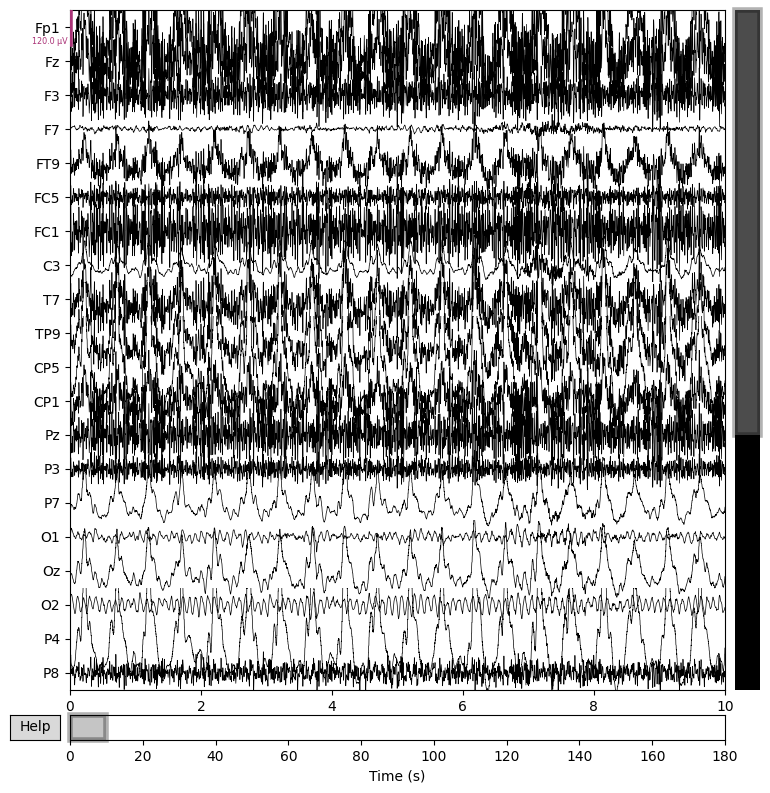
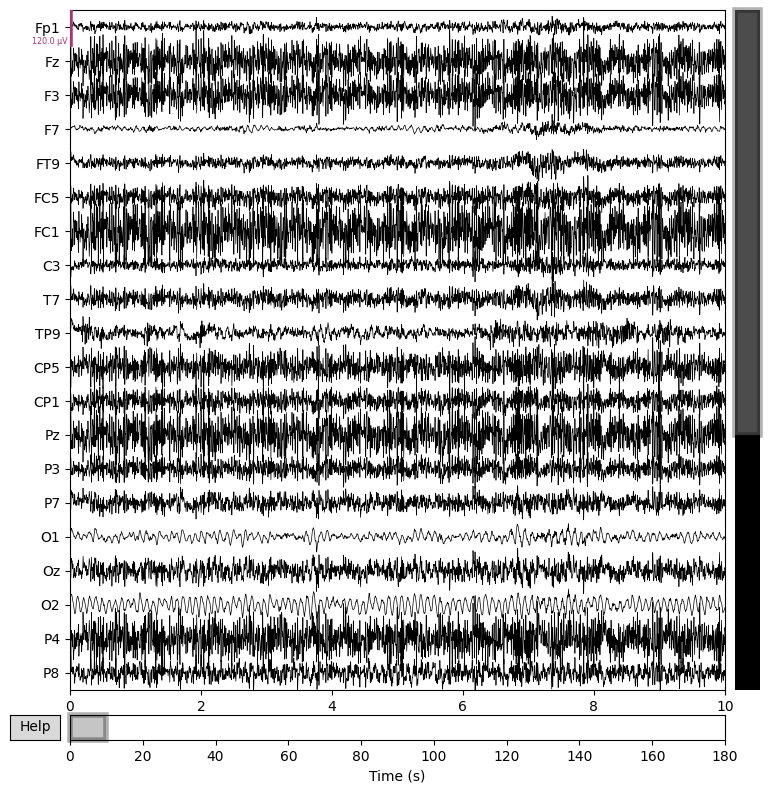
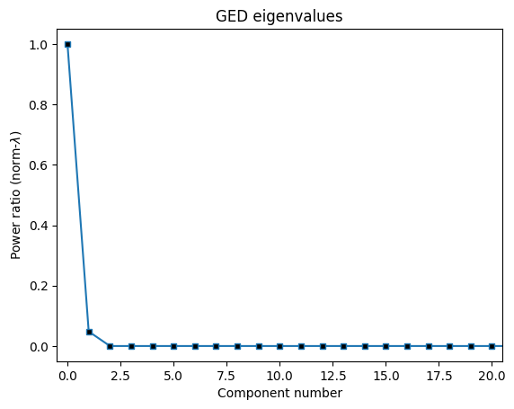

# EEG Motion Artifact Analysis

This project is dedicated to improving the quality of EEG recordings by identifying and mitigating motion artifacts. These artifacts, often caused by subject movement or environmental factors, can distort EEG data and lead to inaccurate interpretations. Our goal is to develop robust algorithms that can detect and reduce the impact of these artifacts, enhancing the reliability of EEG analysis.

## Table of Contents
- [Introduction](#introduction)
- [Data Collection](#data-collection)
- [Artifact Detection](#artifact-detection)
- [Artifact Mitigation](#artifact-mitigation)
- [Results](#results)
- [Running the Example](#running-the-example)
- [Results from the Figs Directory](#results-from-the-figs-directory)
- [Contributing](#contributing)
- [License](#license)

## Introduction
Motion artifacts in EEG recordings, whether from subject movement, electrode displacement, or environmental interference, introduce noise that can obscure meaningful brain activity. This project focuses on developing advanced methods for detecting and mitigating these artifacts, thereby improving the clarity and usability of EEG data.

## Data Collection
Our dataset comprises EEG recordings from human subjects engaged in various tasks under different conditions, capturing both clean and artifact-contaminated data. The data collection process is conducted with strict adherence to ethical guidelines, ensuring informed consent and participant safety.

## Artifact Detection
We utilize cutting-edge signal processing techniques and machine learning algorithms to distinguish between motion artifacts and genuine brain signals. By analyzing both temporal and spectral features, we aim to create accurate, real-time artifact detection methods that enhance EEG data integrity.

## Artifact Mitigation
After detecting motion artifacts, we explore several strategies to minimize their impact. Techniques such as signal interpolation, adaptive filtering, and artifact rejection are employed to restore EEG data quality, enabling precise analysis and interpretation.

## Results
Our results will be showcased through performance metrics, including artifact detection accuracy and mitigation effectiveness. We will also provide a comparative evaluation of our methods against existing benchmarks, highlighting improvements in EEG data quality.

## Running the Example

To run the example code, follow these steps:

1. **Clone the repository:**

    ```bash
    git clone https://github.com/username/repository.git
    ```

2. **Navigate to the project directory:**

    ```bash
    cd repository
    ```

3. **Install the required dependencies:**

    ```bash
    pip install -r requirements.txt
    ```

4. **Execute the example script:**

    ```bash
    python3 example/ged_analysis_simulated_data.py
    ```

    The script will run the analysis and display the results in your console.

## Results from the Figs Directory
Below are some key figures illustrating our results:

- **Simulated Data:**
  

- **Post-GED Analysis:**
  

- **GED Components:**
  

## Contributing
[A tutorial on generalized eigendecomposition for denoising, contrast enhancement, and dimension reduction in multichannel electrophysiology](https://www.sciencedirect.com/science/article/pii/S1053811921010806)
[Exploring patterns enriched in a dataset with contrastive principal component analysis](https://www.nature.com/articles/s41467-018-04608-8)

## License
This project is licensed under the [MIT License](LICENSE). For more details, refer to the LICENSE file.